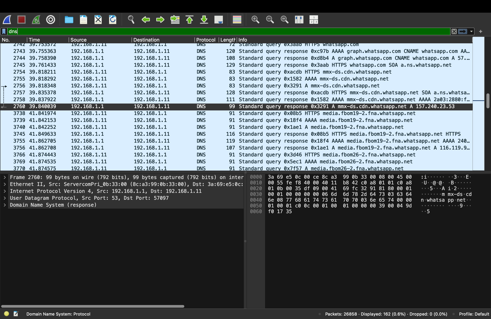
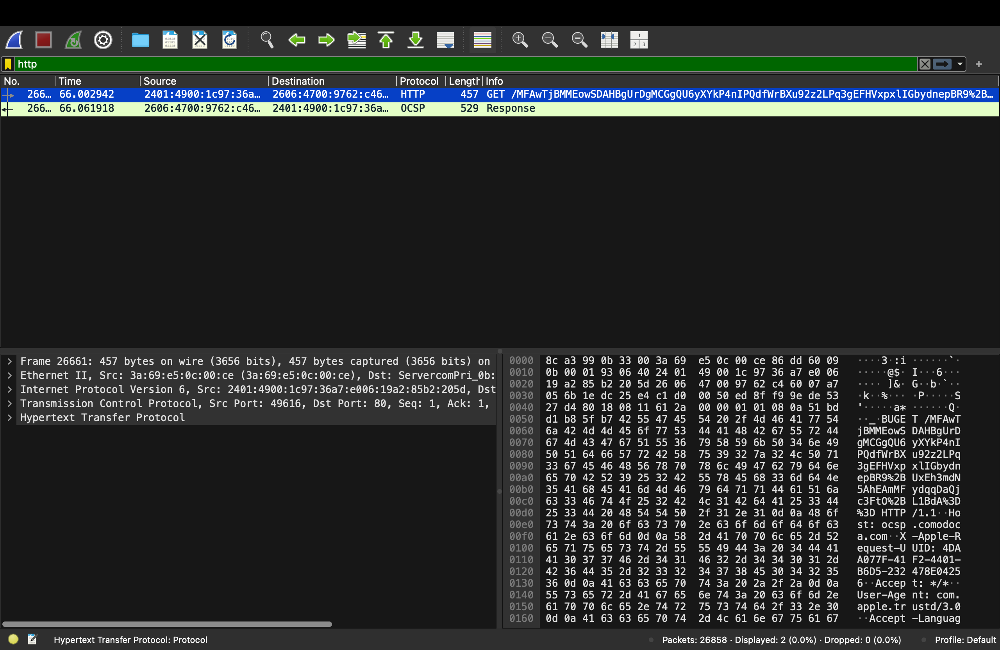
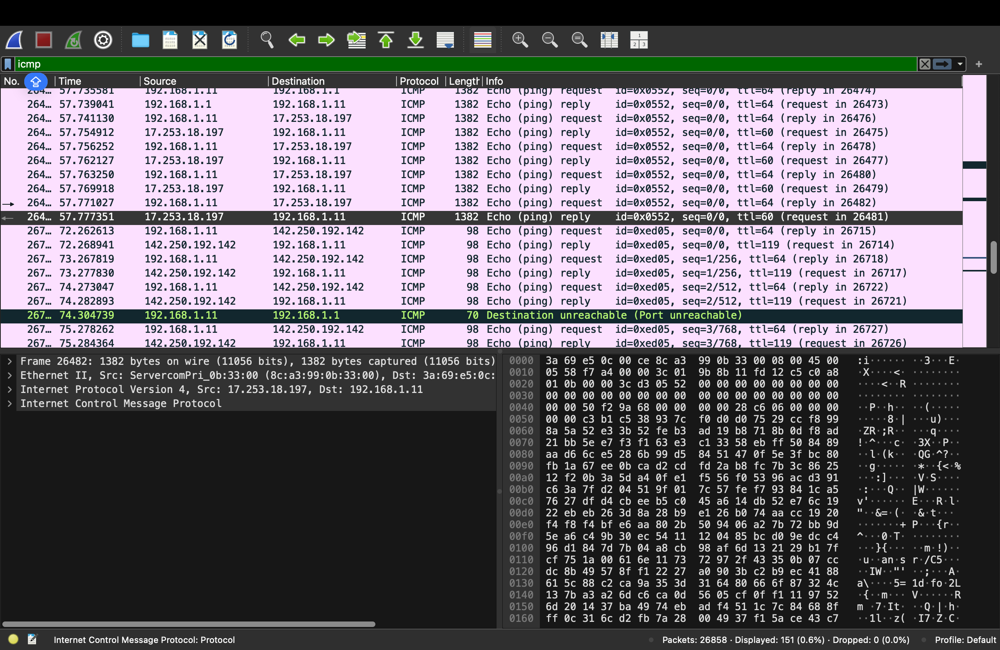
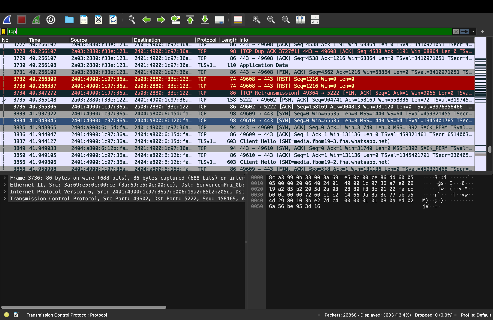

# Network Traffic Capture and Analysis with Wireshark

## 📌 Objective
Capture live network packets and identify basic protocols and traffic types using Wireshark, followed by a deeper analysis of observed HTTP, ICMP, and DNS traffic.

## 🛠 Tools Used
- **Wireshark** (Stable Release 4.4.8 - macOS Arm Disk Image for M4 processor)
- macOS Terminal (for ping tests)
- Web Browser (for generating HTTP/HTTPS traffic)

## 📂 Files in This Repository
- `traffic_capture.pcap` → Packet capture file with all recorded network traffic.
- `screenshots/` → Folder containing screenshots of the Wireshark interface and filters used.
- `README.md` → This documentation file.

## 🔍 Steps Followed
1. Installed **Wireshark** (macOS Arm version for Apple Silicon M4).
2. Started capture on the active network interface (`en0`).
3. Opened a few websites and ran `ping google.com` to generate traffic.
4. Stopped capture after approximately **1 minute**.
5. Applied filters to view specific protocols:
   - `http`
   - `dns`
   - `tcp`
6. Saved the capture as `traffic_capture.pcap`.

## 📑 Protocols Identified
| Protocol | Description | Example Packet Details |
|----------|-------------|------------------------|
| **HTTP** | Hypertext Transfer Protocol used for web communication | GET request to example.com |
| **DNS**  | Domain Name System for resolving domain names to IPs | Query for google.com |
| **TCP**  | Transmission Control Protocol for reliable data transfer | SYN packet initiating a connection |

---

# Network Traffic Analysis Report

## 1. HTTP Traffic
- **Observation:**
  - Detected a GET request over IPv6 to `2606:4700:9762:c46...` (likely Cloudflare infrastructure).
  - Request path contained `/MFAwTjBMMEowSDAHBgUrDgMCGgQU...`
  - Source: `2401:4900:1c97:36a7...`
  - Protocol: HTTP (port 80, unencrypted)
  - User-Agent: `com.apple.trustd/3.0` (macOS trust service)
  - OCSP (Online Certificate Status Protocol) response observed for SSL certificate validation.

- **Impact/Notes:**
  - Standard macOS behavior for certificate trust checks.
  - Traffic unencrypted — metadata could be visible if intercepted.

---

## 2. ICMP Traffic
- **Observation:**
  - Ping (echo) requests/replies between:
    - `192.168.1.11` ↔ `192.168.1.1` (local gateway)
    - `192.168.1.11` ↔ `142.250.192.142` (Google infrastructure)
  - Multiple **Destination unreachable (Port unreachable)** responses from `192.168.1.1`
  - Packet sizes from 98 bytes (normal ping) to 1382 bytes (larger payload tests).

- **Impact/Notes:**
  - Likely connectivity testing or path MTU discovery.
  - “Port unreachable” may indicate a probe to a closed UDP port.

---

## 3. DNS Traffic
- **Observation:**
  - DNS queries from `192.168.1.11` to resolver `192.168.1.1`
  - Resolved domains:
    - `whatsapp.com`
    - `graph.whatsapp.com`
    - `mmx-ds.cdn.whatsapp.net`
    - `media.fbcdn.net`
    - `media.fbm19-2.fna.whatsapp.net`
  - Query types: AAAA (IPv6), A (IPv4), CNAME, HTTPS
  - Responses point to Meta/WhatsApp CDN infrastructure.

- **Impact/Notes:**
  - Device was actively using WhatsApp services.
  - HTTPS queries indicate preparation for encrypted connections.

---

## 4. Summary of Findings
- **Normal Activity:**
  - OCSP requests for certificate checks (macOS)
  - ICMP pings for connectivity
  - DNS lookups for WhatsApp
- **Points of Interest:**
  - OCSP traffic is HTTP (unencrypted)
  - ICMP “Port unreachable” may require further review

---

## 5. Recommendations
1. Enable **OCSP stapling or HTTPS** for certificate checks to avoid unencrypted requests.
2. Review the cause of repeated ICMP port errors to ensure no misconfigured services.
3. No malicious activity detected from the provided packets — traffic matches expected macOS + WhatsApp patterns.

---

---

## 📸 Screenshots

### DNS Traffic

### HTTP Traffic

### ICMP Traffic

### TCP Traffic

---
## 🏆 Outcome
- Learned how to **capture and filter** network packets using Wireshark.
- Identified and analyzed multiple network protocols.
- Gained hands-on packet analysis skills.

**Note:** This analysis is based on selected packet captures and may not reflect all network activity.
